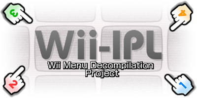
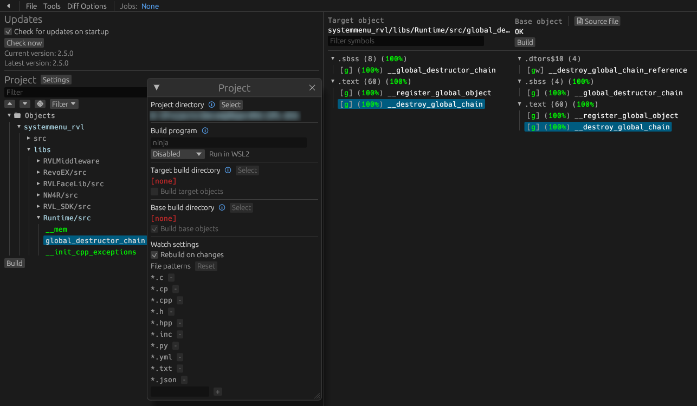

<!--- Github Actions Badge -->

[Build Status]: https://github.com/koopthekoopa/wii-ipl/actions/workflows/build.yml/badge.svg
[actions]: https://github.com/koopthekoopa/wii-ipl/actions/workflows/build.yml

<!--- Discord Badge -->

[Discord Badge]: https://img.shields.io/discord/727908905392275526?color=%237289DA&logo=discord&logoColor=%23FFFFFF
[discord]: https://discord.gg/hKx3FJJgrV

<!-- Progress links -->

[V43U]: https://decomp.dev/koopthekoopa/wii-ipl/43U
[V43E]: https://decomp.dev/koopthekoopa/wii-ipl/43E
[V43J]: https://decomp.dev/koopthekoopa/wii-ipl/43J
[V43K]: https://decomp.dev/koopthekoopa/wii-ipl/43K

<!--- Version 4.3U progress Badge -->

[DecompBadgeV43U]: https://decomp.dev/koopthekoopa/wii-ipl/43U.svg?&measure=code&label=Decompiled&mode=shield&labelColor=%237c7c7c&color=%2333b8ff&style=plastic
[LinkBadgeV43U]: https://decomp.dev/koopthekoopa/wii-ipl/43U.svg?&measure=complete_code&label=Linked&mode=shield&labelColor=%237c7c7c&color=%2333b8ff&style=plastic
[FuncBadgeV43U]: https://decomp.dev/koopthekoopa/wii-ipl/43U.svg?&measure=functions&label=Functions&mode=shield&labelColor=%237c7c7c&color=%2333b8ff&style=plastic

<!--- Version 4.3E progress Badge -->

[DecompBadgeV43E]: https://decomp.dev/koopthekoopa/wii-ipl/43E.svg?measure=code&label=Decompiled&mode=shield&labelColor=%237c7c7c&color=%2333b8ff&style=plastic
[LinkBadgeV43E]: https://decomp.dev/koopthekoopa/wii-ipl/43E.svg?measure=complete_code&label=Linked&mode=shield&labelColor=%237c7c7c&color=%2333b8ff&style=plastic
[FuncBadgeV43E]: https://decomp.dev/koopthekoopa/wii-ipl/43E.svg?measure=functions&label=Functions&mode=shield&labelColor=%237c7c7c&color=%2333b8ff&style=plastic

<!--- Version 4.3J progress Badge -->

[DecompBadgeV43J]: https://decomp.dev/koopthekoopa/wii-ipl/43J.svg?&measure=code&label=Decompiled&mode=shield&labelColor=%237c7c7c&color=%2333b8ff&style=plastic
[LinkBadgeV43J]: https://decomp.dev/koopthekoopa/wii-ipl/43J.svg?&measure=complete_code&label=Linked&mode=shield&labelColor=%237c7c7c&color=%2333b8ff&style=plastic
[FuncBadgeV43J]: https://decomp.dev/koopthekoopa/wii-ipl/43J.svg?&measure=functions&label=Functions&mode=shield&labelColor=%237c7c7c&color=%2333b8ff&style=plastic

<!--- Version 4.3K progress Badge -->

[DecompBadgeV43K]: https://decomp.dev/koopthekoopa/wii-ipl/43K.svg?&measure=code&label=Decompiled&mode=shield&labelColor=%237c7c7c&color=%2333b8ff&style=plastic
[LinkBadgeV43K]: https://decomp.dev/koopthekoopa/wii-ipl/43K.svg?&measure=complete_code&label=Linked&mode=shield&labelColor=%237c7c7c&color=%2333b8ff&style=plastic
[FuncBadgeV43K]: https://decomp.dev/koopthekoopa/wii-ipl/43K.svg?&measure=functions&label=Functions&mode=shield&labelColor=%237c7c7c&color=%2333b8ff&style=plastic

<!--- Header -->

  
Wii Menu  
[![Build Status]][actions] [![Discord Badge]][discord]
========

<!--- Contents -->

A work-in-progress decompilation of the Wii Menu (4.3)

This repository does **not** contain any assets or assembly of the executable whatsoever. An existing WAD of the Wii Menu is required.

Supported versions:
- `43U` - Version **4.3U** (USA)
- `43E` - Version **4.3E** (Europe)
- `43J` - Version **4.3J** (Japan)
- `43K` - Version **4.3K** (Korean)

Progress
========
|        Version        |                                  Progress                                    |
|-----------------------|------------------------------------------------------------------------------|
| [Wii Menu 4.3U][V43U] | [![FuncBadgeV43U]][V43U] [![DecompBadgeV43U]][V43U] [![LinkBadgeV43U]][V43U] |
| [Wii Menu 4.3E][V43E] | [![FuncBadgeV43E]][V43E] [![DecompBadgeV43E]][V43E] [![LinkBadgeV43E]][V43E] |
| [Wii Menu 4.3J][V43J] | [![FuncBadgeV43J]][V43J] [![DecompBadgeV43J]][V43J] [![LinkBadgeV43J]][V43J] |
| [Wii Menu 4.3K][V43K] | [![FuncBadgeV43K]][V43K] [![DecompBadgeV43K]][V43K] [![LinkBadgeV43K]][V43K] |
  
> You can see the full progress and its history by clicking on one of the versions in the table.  

Dependencies
============

Windows
--------

On Windows, it's **highly recommended** to use native tooling. WSL or msys2 are **not** required.  
When running under WSL, [objdiff](#diffing) is unable to get filesystem notifications for automatic rebuilds.

- Install [Python](https://www.python.org/downloads/) and add it to `%PATH%`.
  - Also available from the [Windows Store](https://apps.microsoft.com/store/detail/python-311/9NRWMJP3717K).
- Download [ninja](https://github.com/ninja-build/ninja/releases) and add it to `%PATH%`.
  - Quick install via pip: `pip install ninja`

macOS
------

- Install [ninja](https://github.com/ninja-build/ninja/wiki/Pre-built-Ninja-packages):

  ```sh
  brew install ninja
  ```

[wibo](https://github.com/decompals/wibo), a minimal 32-bit Windows binary wrapper, will be automatically downloaded and used.

Linux
------

- Install [ninja](https://github.com/ninja-build/ninja/wiki/Pre-built-Ninja-packages).

[wibo](https://github.com/decompals/wibo), a minimal 32-bit Windows binary wrapper, will be automatically downloaded and used.

Building
========

- Clone the repository:

  ```sh
  git clone https://github.com/koopthekoopa/wii-ipl.git
  ```

- Copy your WAD to `orig/[Wii Menu Version]`.

- Configure:

  ```sh
  python configure.py
  ```

  To use a version other than the default one, 4.3U, use the `--version` argument.

- Build:

  ```sh
  ninja
  ```

>  [!NOTE]
> This does **not** produce a WAD file, only the executable file, `main.dol`.

> [!WARNING]
> Due to the SEL file not being generated on build, the code is not 100% shiftable.  
> Most of it works aside from a couple of things, such as Wii Settings and a couple of Channel Banners like the Forecast Channel.

Diffing
=======

Once the initial build succeeds, an `objdiff.json` should exist in the project root.

Download the latest release from [encounter/objdiff](https://github.com/encounter/objdiff). Under project settings, set `Project directory`. The configuration should be loaded automatically.

Select an object from the left sidebar to begin diffing. Changes to the project will rebuild automatically: changes to source files, headers, `configure.py`, `splits.txt` or `symbols.txt`.


