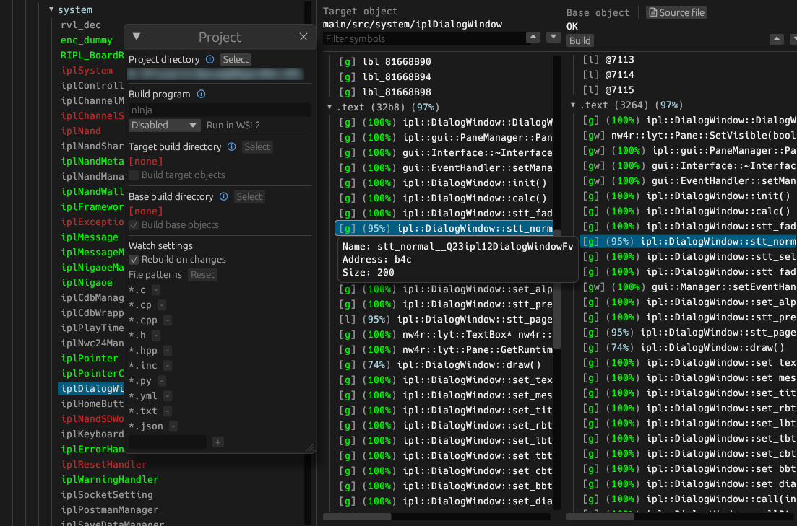

  
Wii Menu  
[![Build Status]][actions] [![Discord Badge]][discord] [![Progress]][progress] [![Linked]][progress]
========

[Build Status]: https://github.com/koopthekoopa/wii-ipl/actions/workflows/build.yml/badge.svg
[actions]: https://github.com/koopthekoopa/wii-ipl/actions/workflows/build.yml
[Discord Badge]: https://img.shields.io/discord/727908905392275526?color=%237289DA&logo=discord&logoColor=%23FFFFFF
[discord]: https://discord.gg/hKx3FJJgrV

[Progress]: https://decomp.dev/koopthekoopa/wii-ipl.svg?mode=shield&measure=code&label=Progress
[Linked]: https://decomp.dev/koopthekoopa/wii-ipl.svg?mode=shield&measure=complete_code&label=Linked
[progress]: https://decomp.dev/koopthekoopa/wii-ipl

A work-in-progress decompilation of the Wii Menu (4.3).

This repository does **not** contain any assets or assembly of the executable whatsoever. An existing WAD of the Wii Menu is required.

Supported versions:
- `43J`: Version **4.3J** (Japan)
- `43U`: Version **4.3U** (USA)
- `43E`: Version **4.3E** (Europe)
- `43K`: Version **4.3K** (Korean)

Installing Dependencies
=======================

Windows
-------

> [!NOTE]
> On Windows, it's **highly recommended** to use native tooling. WSL or MSYS2 are **not** required.  
> When running under WSL, [objdiff](#diffing) is unable to get filesystem notifications for automatic rebuilds.

- Install [Python](https://www.python.org/downloads/) and add it to the `PATH` environment variable.
  - Python is also available from the [Windows Store](https://apps.microsoft.com/store/detail/python-311/9NRWMJP3717K).
- Download the ninja tool [here](https://github.com/ninja-build/ninja/releases) and either add it to the `PATH` environment variable.
  - You can install ninja quickly via pip (if you have it installed via Python's setup)
    - `pip install ninja`

macOS
-----

- Install the [ninja](https://github.com/ninja-build/ninja/wiki/Pre-built-Ninja-packages) tool:

  ```sh
  brew install ninja
  ```

- Install [wine-crossover](https://github.com/Gcenx/homebrew-wine):

  ```sh
  brew install --cask --no-quarantine gcenx/wine/wine-crossover
  ```

After OS upgrades, if macOS complains about `Wine Crossover.app` being unverified, you can unquarantine it using:

```sh
sudo xattr -rd com.apple.quarantine '/Applications/Wine Crossover.app'
```

Linux
-----

- Install [ninja](https://github.com/ninja-build/ninja/wiki/Pre-built-Ninja-packages).
- For non-x86(_64) platforms, you must install wine from your package manager.
  - For x86(_64), [wibo](https://github.com/decompals/wibo), a minimal 32-bit Windows binary wrapper, will be automatically downloaded and used.

Building
========

- Clone the repository:

  ```sh
  git clone https://github.com/koopthekoopa/wii-ipl.git
  ```

- Copy the Wii Menu WAD to `orig/[Wii Menu Version]`.
  - Rename the WAD to `base.wad`

- Configure:

  ```sh
  python configure.py
  ```

  To use a version other than the default one, 4.3U, use the `--version` argument.

- Build:

  ```sh
  ninja
  ```

>  [!NOTE]
> This does **not** prodcue a WAD file. You must replace the exectable with the one you built (`main.app`) manually.

> [!WARNING]
> The code is not 100% shiftable, most of it works aside from a couple of things (such as Wii Settings and a few Channel Banners like the Forecast Channel)

Diffing
=======

Once the initial build succeeds, an `objdiff.json` should exist in the project root.

Download the latest release from [encounter/objdiff](https://github.com/encounter/objdiff). Under project settings, set `Project directory`. The configuration should be loaded automatically.

Select an object from the left sidebar to begin diffing. Changes to the project will rebuild automatically: changes to source files, headers, `configure.py`, `splits.txt` or `symbols.txt`.


